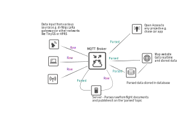

# system_design
Repo for documents explaining how the ukhas-saturn system works.

### Introduction
The current habitat/habhub system while robust is beginning to show its age, built over 8 yrs ago its maintainers have gone on to bigger things. Currently the system runs in multiple VMs on a very old server, there have been multiple requests for an updated version however this haven't materialised. Inspired by the modern state of remote sensing and using more advanced technologies designed for this sort of system ukhas-saturn hopefully will provide a modular system for the next 8 years.

### Description
The system uses [MQTT](https://mqtt.org) as its background messaging protocol, raw data from receiving stations (including stations running dl-fldigi, LoRa gateways, WSPR gateways and other systems) all feed raw data (as json strings) by publishing to the main MQTT broker, each flight has its own 'topic'. The MQTT broker rebroadcasts this raw data to a parser server which parses the strings following pre-defined flight document, this server then publishes the parsed packets back to the MQTT broker which goes out on the 'parsed' subtopic. These flight topics can be subscribed to by applications such as a mapping website (in the style of spacenear.us) or chase car apps or can be feed into other systems such as the APRS network or TinyGS network.

### Network Diagram

### Example Topics
#### Telemetry Strings
* raw/icarus/
* raw/pegasus/
* parsed/icarus/
* parsed/pegasus/
* parsed/pegasus/flight_1

#### Listener Details
* listener

#### Other
* announcements
* announcements/listeners
* announcements/flights
